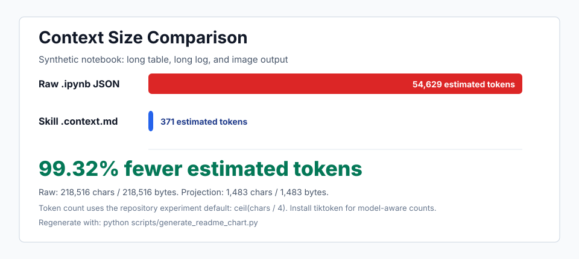

# Notebook Context

[English](README.md)

一个用于处理 Jupyter Notebook 的 Codex skill，目标是在不把完整 `.ipynb` JSON 塞进模型上下文的情况下，安全读取、编辑和验证 notebook。

它会把 notebook 转换成轻量、可按 cell 定位的 Markdown 投影视图；编辑完成后，再把 source 修改安全应用回原始 notebook，并尽量保留 notebook 的 fidelity：metadata、outputs、execution count、attachments、nbformat 等默认不丢失。

## 为什么需要它

Jupyter Notebook 经常包含大量 outputs、base64 图片、widget state、metadata、execution count，以及转义后的 JSON 字符串。对 coding agent 来说，这些内容既浪费上下文，也增加误改 notebook 结构的风险。

Notebook Context 不是 Jupytext 或 nbconvert 的替代品。它是一个面向 agent 的临时工作流：

- `.ipynb` 始终是权威源文件。
- `.context.md` 只是临时编辑投影。
- 回写时以 base notebook 为准，只更新 cell `source`。
- metadata、outputs、execution count、attachments、nbformat 字段默认保留。
- drift detection 会阻止过期 Markdown 静默覆盖新的 notebook 修改。

## 上下文节省效果



这张图使用一个 synthetic analysis notebook：包含长 training log、同时渲染为 `text/plain` 和 `text/html` 的长表格，以及一个大型 `image/png` 输出。它展示的是本工具针对的典型长输出场景，不代表所有 notebook 的通用 benchmark。

重新生成图表：

```bash
python scripts/generate_readme_chart.py
```

## 仓库结构

```text
.
├── SKILL.md
├── assets/
│   └── context-size-comparison.svg
├── scripts/
│   ├── notebook_to_context_md.py
│   ├── context_md_to_notebook.py
│   ├── validate_notebook.py
│   ├── inspect_notebook_outputs.py
│   ├── extract_notebook_media.py
│   ├── compare_context_size.py
│   └── generate_readme_chart.py
└── tests/
    ├── fixtures/
    └── test_roundtrip.py
```

## 快速开始

导出轻量 Markdown 投影视图：

```bash
python scripts/notebook_to_context_md.py analysis.ipynb --out analysis.context.md
```

编辑 `analysis.context.md` 后，应用回 notebook：

```bash
python scripts/context_md_to_notebook.py analysis.context.md --base analysis.ipynb --out analysis.ipynb
```

验证结果：

```bash
python scripts/validate_notebook.py analysis.ipynb
```

只查看某个 cell 的 outputs：

```bash
python scripts/inspect_notebook_outputs.py analysis.ipynb --cell CELL_ID_OR_INDEX
```

需要查看图片或富媒体输出时，只导出指定 payload：

```bash
python scripts/extract_notebook_media.py analysis.ipynb --cell CELL_ID_OR_INDEX --output 0 --mime image/png --out output.png
```

比较直接读取 JSON 和使用 skill projection 的上下文大小：

```bash
python scripts/compare_context_size.py analysis.ipynb
```

## 常用参数

导出时内联小型文本输出：

```bash
python scripts/notebook_to_context_md.py analysis.ipynb --include-small-text-outputs
```

只查看某个 output：

```bash
python scripts/inspect_notebook_outputs.py analysis.ipynb --cell plot --output 0
```

只查看 output 摘要：

```bash
python scripts/inspect_notebook_outputs.py analysis.ipynb --cell plot --summary-only
```

从某个 output 中导出默认的图片/SVG/PDF 类 payload：

```bash
python scripts/extract_notebook_media.py analysis.ipynb --cell plot --output 0
```

输出机器可读的 context-size 指标：

```bash
python scripts/compare_context_size.py analysis.ipynb --json
```

如果本地安装了 `tiktoken`，`compare_context_size.py` 会使用 tokenizer 计数。否则会用 `ceil(chars / 4)` 估算 tokens，同时仍然提供精确的 bytes、characters 和 lines。

## 安全模型

`context_md_to_notebook.py` 会检查 `.context.md` 中记录的 source hash 是否与 base notebook 一致。如果 notebook 在导出后被外部修改，默认会拒绝 apply。

只有在你已经检查过冲突并确认要继续时，才使用 `--allow-drift`：

```bash
python scripts/context_md_to_notebook.py analysis.context.md --base analysis.ipynb --allow-drift
```

当前 MVP 支持修改已有 cell 的 source。它刻意不支持新增或删除 cell，避免 agent 意外破坏 notebook 结构。

## 作为 Codex Skill 安装

把仓库 clone 到 Codex skills 目录：

```bash
git clone <repo-url> ~/.codex/skills/notebook-context
```

然后显式调用：

```text
Use $notebook-context to edit analysis.ipynb.
```

## 测试

运行标准库测试：

```bash
python -m unittest discover -s tests
```

## License

MIT

## 友情链接
https://Linux.do